# FreshFridge iOS App

## Overview
FreshFridge is a mobile app built with Xcode that helps users track food items and their expiration dates in their fridge. This prevents food waste by notifying users when items are close to expiring.

## Features
- User authentication - users can create accounts, log in/out, and delete accounts
- Add food items - name, quantity, expiration date, upload photo
- View items sorted into two lists
  - Expired items
  - Effective (not expired yet) items
- Item information displayed:
  - Name
  - Quantity
  - Days until expiration
- Localization - English and Chinese language support
  
## Technical Details
- Built with Xcode and Swift
- Persists data locally on device so items remain if user logs out
- Integrates camera for capturing photos of items
- Leverages Cocoapods for managing third-party libraries

## Project Files
- **FreshFridge.xcworkspace** - Xcode workspace
- **Podfile** - Defines Cocoapods dependencies
- **Podfile.lock** - Lock file for pinning dependency versions

## Demo
See the app demo on YouTube:

https://youtu.be/UM75QpOM9hQ

When first open the app, users can choose to login or signin

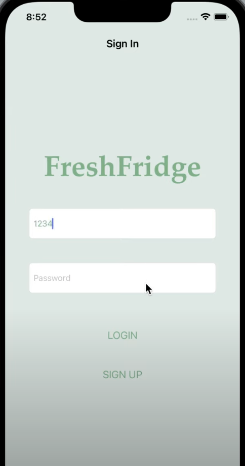

After login to the app, users can view the list for effective food in the fridge and the list for expired food in the fridge

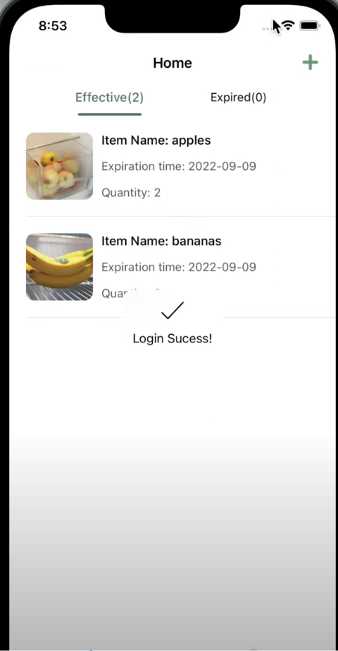 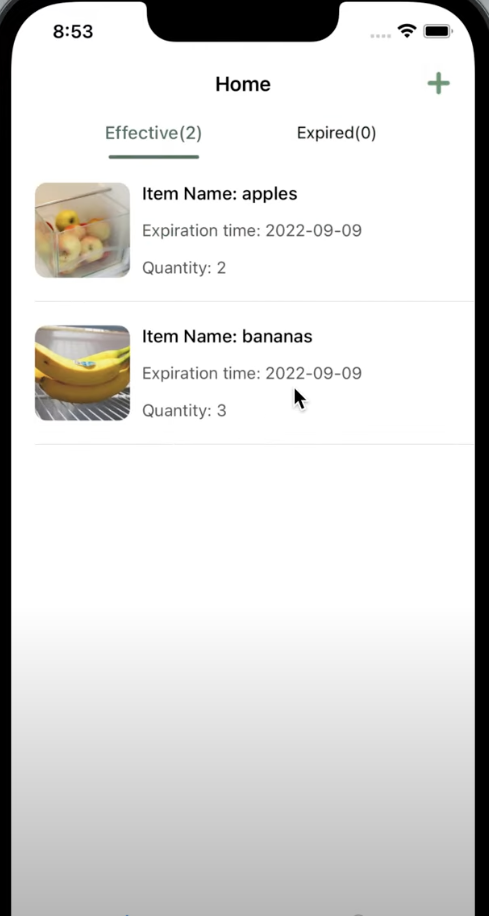 

Users can click into a food item to view the details of it as well as updating the information for the food, including expiration date

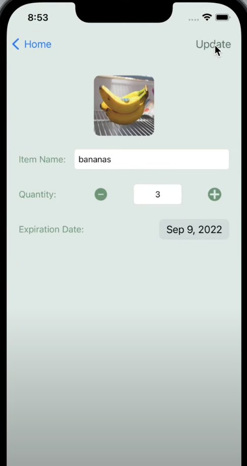 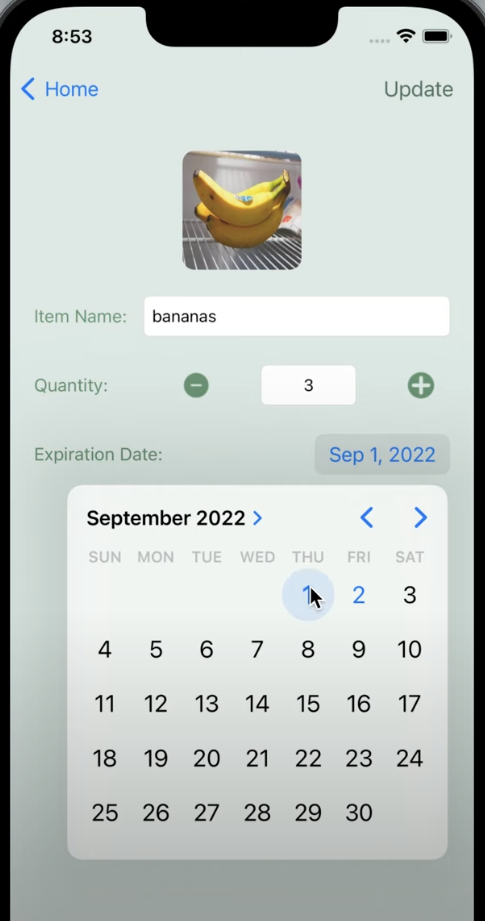 

After updating or at any point, if it turns out that a food has expired (based on the inputted expiration date for that food), the food will automatically be moved from the effective list to the expired list

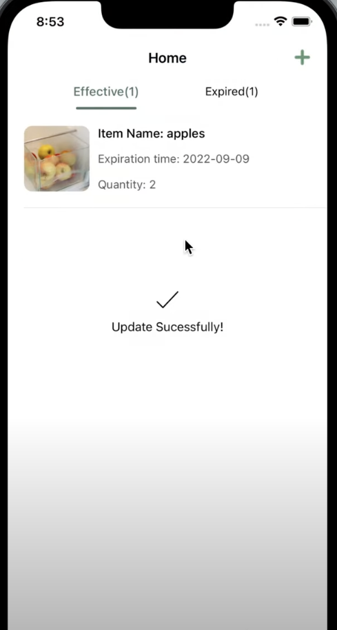 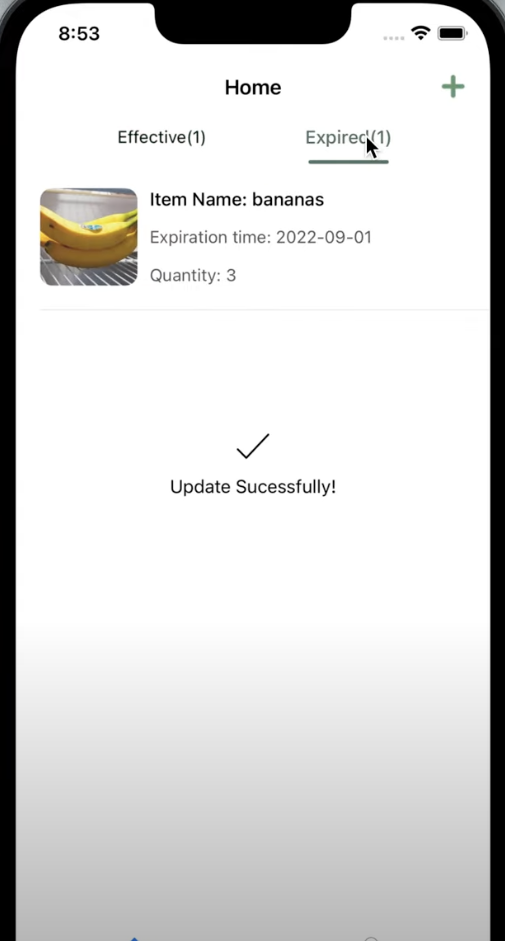 

Back to the home page for table view, users can also tap the plus button on the top right corner on the screen to add a new food item to the record

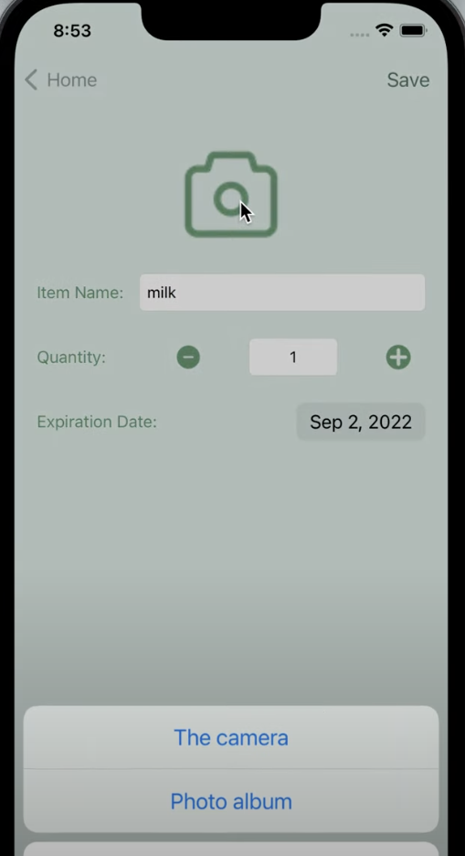  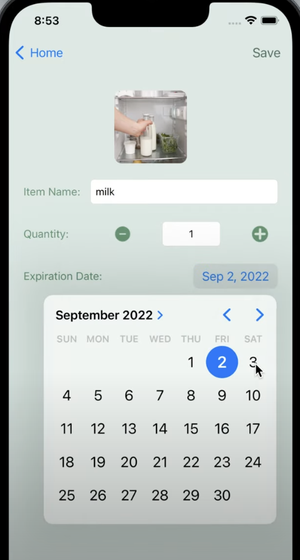 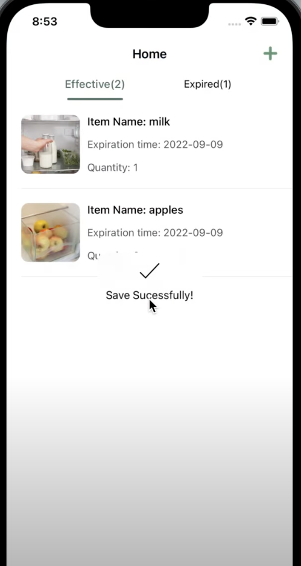

A user can also edit his or her information in the Mine tab, including changing languages, logging out, and deleting account

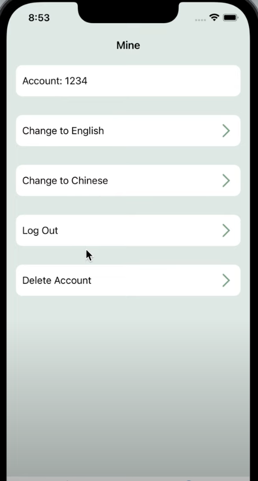

## Getting Started
- Clone the repo
- Run pod install
- Open FreshFridge.xcworkspace
- Build and run the app on simulator or device
